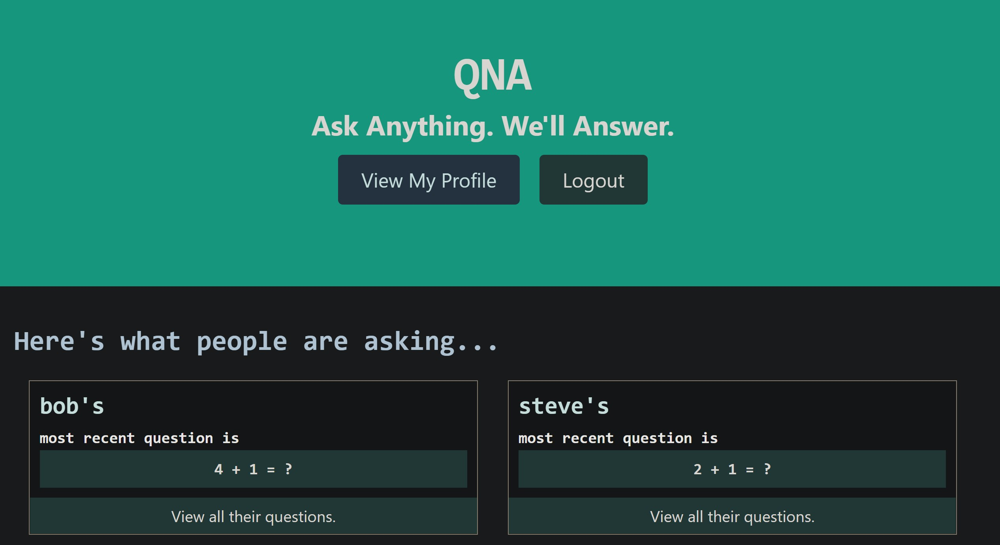

# QNA - The Simple Question and Answer App

A simple and clean application for asking and answering questions.

## Description & Functionality

Users can create profiles ask and answer questions, and upvote and downvote answers.

### Installation & Usage Instructions

### Technologies Used

MongoDB, Express.js, React, Node.js, Apollo, GraphQL

### Challenges Encountered

Had a lot of trouble with GraphQL and navigating the errors. 

### Directions for Future Development

Would be interesting to add a roulette functionality not unlike tinder or chatroulette. 

## Screenshot

## Links

[LinkName](Link)